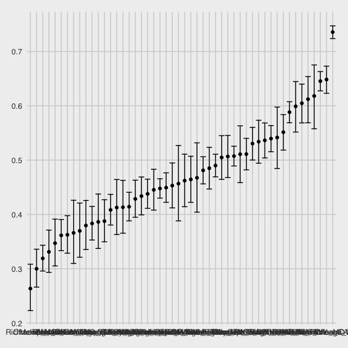

iteration\_class
================
Alexey Abramov
11/9/2020

  - [Setup](#setup)
  - [Problem 2 ideas…](#problem-2-ideas)

# Setup

``` r
library(tidyverse)
```

    ## ── Attaching packages ──────────────────────────────────────────────── tidyverse 1.3.0 ──

    ## ✓ ggplot2 3.3.2     ✓ purrr   0.3.4
    ## ✓ tibble  3.0.3     ✓ dplyr   1.0.2
    ## ✓ tidyr   1.1.2     ✓ stringr 1.4.0
    ## ✓ readr   1.3.1     ✓ forcats 0.5.0

    ## ── Conflicts ─────────────────────────────────────────────────── tidyverse_conflicts() ──
    ## x dplyr::filter() masks stats::filter()
    ## x dplyr::lag()    masks stats::lag()

``` r
library(readr)
library(rvest)
```

    ## Loading required package: xml2

    ## 
    ## Attaching package: 'rvest'

    ## The following object is masked from 'package:purrr':
    ## 
    ##     pluck

    ## The following object is masked from 'package:readr':
    ## 
    ##     guess_encoding

``` r
knitr::opts_chunk$set(
  fig.width = 6,
  fig.height = 6,
  out.width = "90%"
)

theme_set(
  ggthemes::theme_fivethirtyeight() + theme(legend.position = "bottom")
  )

options(
  ggplot2.continuous.colour = "viridis",
  ggplot2.continuous.colour = "viridis"
)

scale_colour_discrete = scale_color_viridis_d
scale_fill_discrete = scale_fill_viridis_d
```

Load in dataset

``` r
homicide_df = read_csv("data/homicides.csv")
```

    ## Parsed with column specification:
    ## cols(
    ##   uid = col_character(),
    ##   reported_date = col_double(),
    ##   victim_last = col_character(),
    ##   victim_first = col_character(),
    ##   victim_race = col_character(),
    ##   victim_age = col_character(),
    ##   victim_sex = col_character(),
    ##   city = col_character(),
    ##   state = col_character(),
    ##   lat = col_double(),
    ##   lon = col_double(),
    ##   disposition = col_character()
    ## )

Data wrangling

``` r
homicide_df =
  homicide_df  %>% 
  mutate(
    city_state = str_c(city, state, sep = "_"),
    resolved = case_when(
            disposition == "Closed without arrest" ~ "unsolved",
            disposition == "Open/No arrest" ~ "unsolved",
            disposition == "Closed by arrest" ~ "solved")) %>% 
  select(city_state, resolved) %>% 
  filter(city_state != "Tulsa_AL")
```

``` r
aggregate_df =
  homicide_df %>% 
  group_by(city_state) %>% 
  summarize(
    hom_total = n(),
    hom_unsolved = sum(resolved =="unsolved")
  )
```

    ## `summarise()` ungrouping output (override with `.groups` argument)

Can I do a prop test for a single city?

``` r
prop.test(
  aggregate_df %>% filter(city_state == "Baltimore_MD") %>% pull(hom_unsolved),
  aggregate_df %>% filter(city_state == "Baltimore_MD") %>% pull(hom_total)) %>% 
  broom::tidy()
```

    ## # A tibble: 1 x 8
    ##   estimate statistic  p.value parameter conf.low conf.high method    alternative
    ##      <dbl>     <dbl>    <dbl>     <int>    <dbl>     <dbl> <chr>     <chr>      
    ## 1    0.646      239. 6.46e-54         1    0.628     0.663 1-sample… two.sided

``` r
results_df =
  aggregate_df %>% 
  mutate(
    prop_tests = map2(.x = hom_unsolved, .y = hom_total, ~prop.test(x = .x, n = .y)),
    tidy_tests = map(.x = prop_tests, ~ broom::tidy(.x))) %>% 
  select(-prop_tests) %>% 
  unnest(tidy_tests) %>% 
  select(city_state, estimate, conf.low, conf.high)
```

Graphing results

``` r
results_df %>% 
  mutate(
    city_state = fct_reorder(city_state, estimate)) %>% 
  ggplot(aes(x = city_state, y = estimate)) +
  geom_point() + 
  geom_errorbar(aes(ymin = conf.low, ymax = conf.high))
```



# Problem 2 ideas…

Import one data set

data\_1 = read\_csv lda\_data / con\_01.csv list.files(“lda\_data”)… Put
that into a tibble …

path\_df = tibble( path = list.files(“lda\_data”)) %\>% mutate(path =
str\_c(“lda\_data/”, path), data = map(……..)

Control vs. Experiment… Mutate, str\_c, pivot\_longer for the dates

path\_df\(path[[1]] read_csv(path_df\)path\[\[1\]\])
